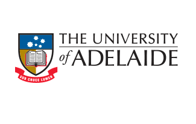

# iRotAvg

Author: [Alvaro Parra](http://alvaroparra.com)

iRotAvg (incremental rotation averaging) incrementally solves rotation averaging. iRotAvg is the optimisation core of L-infinity SLAM presented in [[Á. Parra, T.-J. Chin, A. Eriksson, I. Reid: Visual SLAM: Why bundle adjust?, ICRA 2019](https://cs.adelaide.edu.au/~aparra/publication/parra19_icra/)]. 

This work was supported by [Maptek](http://maptek.com) and the ARC Grant DP160103490.


<p align="center">
    <a href="http://maptek.com">
        
    </a> <hr> <hr>
    <a href="https://www.adelaide.edu.au">
        
    </a>
</p>


## Related Publication:

[Á. Parra, T.-J. Chin, A. Eriksson, I. Reid: Visual SLAM: Why bundle adjust?, ICRA 2019](https://cs.adelaide.edu.au/~aparra/publication/parra19_icra/)


## License

iRotAvg is released under a GPLv3 license. 

For a closed-source version of iRotAvg (e.g., for commercial purposes), please [contact the author](https://cs.adelaide.edu.au/~aparra/#contact).

For an academic use of iRotAvg, please cite
[Á. Parra, T.-J. Chin, A. Eriksson, I. Reid: Why bundle adjust?, ICRA 2019](https://cs.adelaide.edu.au/~aparra/publication/parra19_icra/).


## Dependencies

- Eigen
- SuiteSparse
- opencv
- Boost (Filesystem)


In Mac: 

- `brew install eigen`
- `brew install suite-sparse`
- `brew install opencv`
- `brew install boost`

In Ubuntu:
-  `sudo apt install libeigen3-dev`
- `sudo apt-get install libsuitesparse-dev`
- `sudo apt-get install libboost-all-dev`
- `For OpenCV wise, https://www.pyimagesearch.com/2018/05/28/ubuntu-18-04-how-to-install-opencv/ provides a good guide.`


## Compilation

- `mkdir build`
- `cd build`
- `cmake ..`
- `make`

(binary is compiled inside src)


## Execution

General usage follows ORB-SLAM input:

`./irotavg orb_vocab.txt config.yaml sequence_path`

where

- `orb_vocab.txt`  Orb vocabulary as in ORB-SLAM. 
- `config.yaml`  Configuration file as in ORB-SLAM.
- `sequence_path`  Directory containing the frame sequence.

To see more usage options simply execute:
```
./irotavg
```

## Testing with the KITTI dataset

To test iRotAvg with the KITTI dataset:


1. Download the grayscale sequences from [here](http://www.cvlibs.net/datasets/kitti/eval_odometry.php).
1. Download a configuration file from the ORB-SLAM [monocular exampes](https://github.com/raulmur/ORB_SLAM2/tree/master/Examples/Monocular). E.g.: [KITTI00-02.yaml](https://github.com/raulmur/ORB_SLAM2/blob/master/Examples/Monocular/KITTI00-02.yaml) for sequences 0 to 2.
1. Download and uncompress the orb vocabulary file from [here](https://github.com/raulmur/ORB_SLAM2/tree/master/Vocabulary).
1. Execute `irotavg` passing the corresponding paths: `./irotavg path/to/orb_vocab.txt path/to/config.yaml path/to/sequence/`
 
 The output is saved to:
-  `rotavg_poses_ids.txt` Contains the ids (starting in 1) of frames in the view-graph (selected frames).
- `rotavg_poses.txt`  Contains the computed absolute poses.

