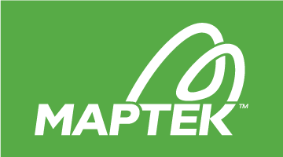

# RAL

Author: [Alvaro Parra](http://alvaroparra.com)

Implementation of rotation averaging algorithms for [iRotAvg](https://github.com/ajparra/iRotAvg/). This implementations allow to fix an arbitrary number of rotations. Instead of conventionally fixing one rotation only (usually the first rotation as the identity), fixing multiple rotations allows to:
- Incorporate known absolute rotations to rotation averaging.
- Efficiently combine multiple rotations averaging problems, e.g., addressing a (large) problem by incrementally optimising over the relative rotations or by chunks.


This work was supported by [Maptek](http://maptek.com) and the ARC Linkage Project LP140100946.

<p align="center">
<a href="http://maptek.com">

</a> &nbsp; &nbsp; &nbsp;
<a href="https://www.adelaide.edu.au">

</a>
</p>


## Related Publication:

[Á. Parra, T.-J. Chin, A. Eriksson, I. Reid: Visual SLAM: Why bundle adjust?, ICRA 2019](https://cs.adelaide.edu.au/~aparra/publication/parra19_icra/)


## License

iRotAvg is released under a GPLv3 license. 

For a closed-source version of iRotAvg (e.g., for commercial purposes), please [contact the author](https://cs.adelaide.edu.au/~aparra/#contact).

For an academic use of iRotAvg, please cite
[Á. Parra, T.-J. Chin, A. Eriksson, I. Reid: Why bundle adjust?, ICRA 2019](https://cs.adelaide.edu.au/~aparra/publication/parra19_icra/).


## Dependencies

 - SuiteSparse
 - Eigen
 
 In Mac: 
 
 - `brew install eigen`
 - `brew install suite-sparse`

 In Ubuntu:
 -  `sudo apt install libeigen3-dev`
 - `sudo apt-get install libsuitesparse-dev`
 
 
## Compilation

- `mkdir build`
- `cd build`
- `cmake ..`
- `make`

## Execution
To see usage simply execute
```
./l1_irls
```

An example is provided in the folder data. To test the method run:
```
./l1_irls ../data/ravg_input.txt
```
